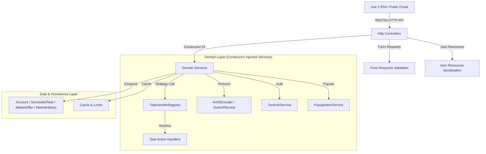

# SOLID Refactoring Architectural Design

## 1. System Architecture Diagram



---

## 2. Component Design, REST Principles & Serialization

### 2.1 RESTful Routing & Status Codes
All API routes in `routes/api.php` adhere to REST standards:
- **Resource Nouns**: Plural resource naming (`/api/accounts`, `/api/tasks`, `/api/market/servers`, `/api/market/popular`).
- **HTTP Methods**: `GET` for reads, `POST` for creations/actions, `PUT`/`PATCH` for updates, `DELETE` for removals.
- **Consistent Response Envelopes**: `ApiResponder` standardizes HTTP status codes (`200`, `201`, `204`, `400`, `401`, `403`, `404`, `422`, `500`).

### 2.2 Dependency Injection Rules
- **Constructor Property Promotion**: All dependencies MUST be injected via constructor property promotion (`public function __construct(private readonly ServiceInterface $service)`).
- **No Static Facades in Services**: Refactor any static calls (`DB::`, `Cache::`, `Log::`) in domain services into injected instances.

### 2.3 JsonResources Serialization Standard
All domain entity responses must be wrapped in explicit JsonResource classes:
- `MarketOfferResource`: Serializes market offer listings with price, time left, and volume calculation.
- `MarketSyncLogResource`: Serializes synchronization log entries.
- `PublicServerResource`: Serializes public server connections with localized world names.
- `PopularItemResource`: Serializes popular market items.
- `AccountResource` *(Planned)*: Serializes account state, status badges, and connection indicators.
- `ScheduledTaskResource` *(Planned)*: Serializes scheduled sequence, buff, and specialist tasks.

### 2.4 Task Planner Engine
- **Contract**: `App\Services\Tasks\Contracts\TaskActionHandlerInterface`
- **Registry**: `TaskHandlerRegistry` receives all handlers lazily via container resolution to maintain compatibility with test mocking frameworks (`Mockery`).
- **Service Providers**: Registered in `App\Providers\TaskServiceProvider`.

---

## 3. Directory Layout Compliance

All new classes must stay within existing top-level application structure:

```text
app/
├── Http/
│   ├── Controllers/
│   │   ├── AccountController.php
│   │   ├── Market/
│   │   │   ├── AnalyticsController.php
│   │   │   ├── ArbitrageController.php
│   │   │   ├── BulkController.php
│   │   │   ├── CatalogController.php
│   │   │   ├── PopularController.php
│   │   │   ├── PublicServerController.php
│   │   │   ├── ServerController.php
│   │   │   ├── SettingsController.php
│   │   │   ├── SyncLogController.php
│   │   │   └── VersionController.php
│   │   └── ScheduledTaskController.php
│   ├── Requests/
│   │   ├── Account/
│   │   ├── Market/
│   │   └── Tasks/
│   └── Resources/
│       ├── AccountResource.php (Planned)
│       ├── MarketOfferResource.php
│       ├── MarketSyncLogResource.php
│       ├── PopularItemResource.php
│       ├── PublicServerResource.php
│       └── ScheduledTaskResource.php (Planned)
├── Providers/
│   ├── MarketServiceProvider.php
│   ├── TaskServiceProvider.php
│   └── TsoServiceProvider.php
├── Services/
│   ├── AccountService.php
│   ├── Amf/
│   │   └── Amf3Encoder.php
│   ├── Market/
│   │   ├── Contracts/
│   │   ├── Support/
│   │   ├── MarketAnalyticsService.php
│   │   ├── MarketBulkService.php
│   │   ├── MarketCatalogService.php
│   │   ├── MarketOfferQueryService.php
│   │   ├── MarketServerService.php
│   │   ├── MarketSettingsService.php
│   │   ├── PopularItemService.php
│   │   └── ServerPresetProvider.php
│   ├── Tasks/
│   │   ├── Contracts/
│   │   ├── Handlers/
│   │   └── TaskHandlerRegistry.php
│   ├── TaskExecutionService.php
│   ├── TsoAmfService.php
│   └── TsoAuthService.php
```
