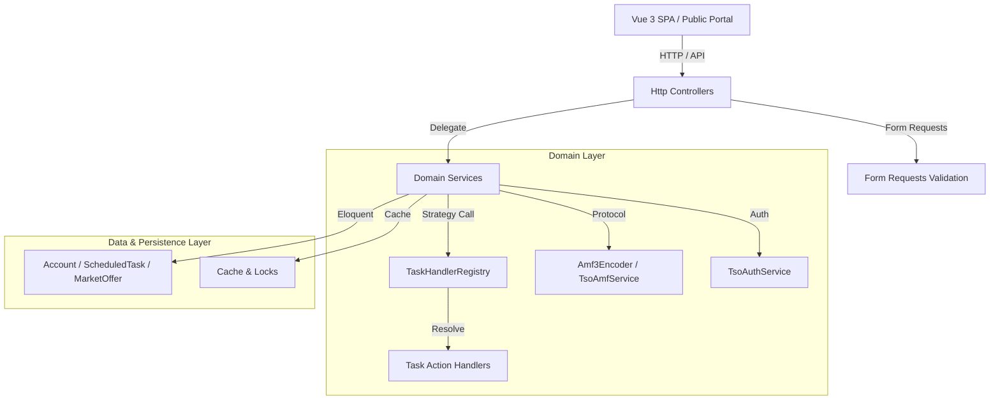

# SOLID Refactoring Architectural Design

## 1. System Architecture Diagram



---

## 2. Component Design & Abstractions

### 2.1 Task Planner Engine
- **Contract**: `App\Services\Tasks\Contracts\TaskActionHandlerInterface`
  ```php
  interface TaskActionHandlerInterface
  {
      public function supports(string $actionType): bool;
      public function handle(Account $account, array $payload): string;
  }
  ```
- **Registry**: `TaskHandlerRegistry` receives all handlers lazily via container resolution to maintain compatibility with test mocking frameworks (`Mockery`).
- **Service Providers**: Registered in `App\Providers\TaskServiceProvider`.

### 2.2 Account Management Boundary
- **Form Requests**: `StoreAccountRequest`, `ExecuteAccountActionRequest`, `UpdateAccountSessionRequest`.
- **Domain Service**: `AccountService` encapsulates cookie cleanup, session updates, action delegation, and friend zone caching/stale fallback.
- **Slim Controller**: `AccountController` contains methods strictly under 10 lines.

### 2.3 AMF & Protocol Isolation
- **Encoder**: `App\Services\Amf\Amf3Encoder` handles binary serialization into AMF3.
- **Service Provider**: `App\Providers\TsoServiceProvider` binds `TsoAuthService` and `TsoAmfService`.

---

## 3. Directory Layout Compliance

All new classes must stay within existing top-level application structure:

```text
app/
├── Http/
│   ├── Controllers/
│   │   ├── AccountController.php
│   │   ├── Market/
│   │   └── ScheduledTaskController.php
│   └── Requests/
│       ├── Account/
│       ├── Market/
│       └── Tasks/
├── Providers/
│   ├── MarketServiceProvider.php
│   ├── TaskServiceProvider.php
│   └── TsoServiceProvider.php
├── Services/
│   ├── AccountService.php
│   ├── Amf/
│   │   └── Amf3Encoder.php
│   ├── Market/
│   ├── Tasks/
│   │   ├── Contracts/
│   │   ├── Handlers/
│   │   └── TaskHandlerRegistry.php
│   ├── TaskExecutionService.php
│   ├── TsoAmfService.php
│   └── TsoAuthService.php
```
